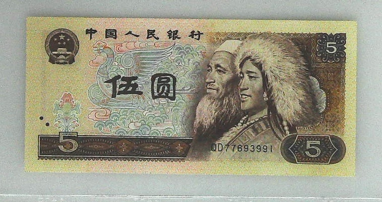

## 人民币编码识别

### 1.赛题说明
由Tinymind主办的人民币编码识别大赛，分别包括面值识别和冠字号码文字识别两大部分组成。

比赛官网：https://www.tinymind.cn/competitions/47  
比赛时间：2019年5月9日 ~ 2019年12月31日

数据集:   
链接: https://pan.baidu.com/s/1nt03m3JddC93HIx0II-z5w 提取码: nk8g  
数据包含训练集和测试集两大部分  
```
├─训练集
│       train_data.z01
│       train_data.z02
│       train_data.z03
│       train_data.z04
│       train_data.z05
│       train_data.zip
│       train_face_value_label.csv
│       train_id_label.csv
└─测试集
       private_test_data.zip
       public_test_data.z01
       public_test_data.zip
```
其中 train_data.* 为图像数据，共39620张图像，如下图  
  

train_face_value_label.csv 为面值大小标记文件，以文件名和面值大小一一对应：
```buildoutcfg
013MNV9B.jpg, 100
016ETNGG.jpg, 50
018SUTBA.jpg, 0.1
0192G5IC.jpg, 5
```

train_id_label.csv 为冠字号码标记文件：
```buildoutcfg
GK5NXT2E.jpg, SJ88154371
PNFRISAL.jpg, XI90599371
2GVHF7RK.jpg, WG35669371
DGUVOETG.jpg, YH01075371
```
（注：根据一些比赛队伍表示，标记中存在个别错误的label）  

训练集中没有对冠字号码的ROI区域进行标记，可能需要自己手动标记。

### 2. 解决方案
### 2.1 面值识别

面值识别本质就是最简单的分类问题，考虑采用keras加载预训练模型实现。

<code>step1_split_train_dataset.py</code>：整理数据集  
训练集用20000张，其余的19620张作为验证集  

<code>step2_classification.py</code>:利用Keras内建的预训练模型，快速搭建分类模型，完成面值识别分类任务。  
`step3_finetune.py`：在step2的基础上微调网络，提高准确率。  
`step4_evaluate.py`：在public_test_data数据集上进行测试，输出结果，提交到官网，完成热身赛。实际训练数据用了900张，验证集900张

### 2.2 编码识别  
编码识别的整体思路是现在图像中提取编码区域的ROI，然后对提取的区域进行定长字符识别。由于官方没有给编码区域的ROI标注
所以在这里用了一些别的参赛大佬已经标注好的部分区域，见[此](https://github.com/DueapeCommon/kaggle/blob/master/solutions/TinyMind%E4%BA%BA%E6%B0%91%E5%B8%81%E9%9D%A2%E5%80%BC%26%E5%86%A0%E5%AD%97%E5%8F%B7%E7%BC%96%E7%A0%81%E8%AF%86%E5%88%AB%E6%8C%91%E6%88%98%E8%B5%9B/task2/VOC2007.zip)

用`tools/splittrainval.py/`规范化一下大佬的数据。  
弄完之后的格式是
```
├─train
│  ├──images
│  └──annos
└─val
   ├──images
   └──annos
```  

`step5_detection.py`搭建目标检测模型。基于yolo思路，针对特定问题进行了优化  
`rmbgenerator.py`构建数据生成器。  
`stloss.py`自定义的yolo loss计算方法  
`step6_fintune_dt.py`在step5的基础上进行微调。    
`step7_predict.py`可视化目标检测效果  

训练好的模型参数：链接: https://pan.baidu.com/s/1xMgE181iw1mguoySNLWxhg 提取码: zzk5   

---
注：实验过程中的一些记录写在了experiment_log.md文件中。


